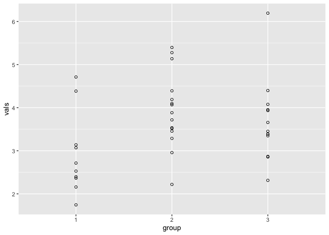
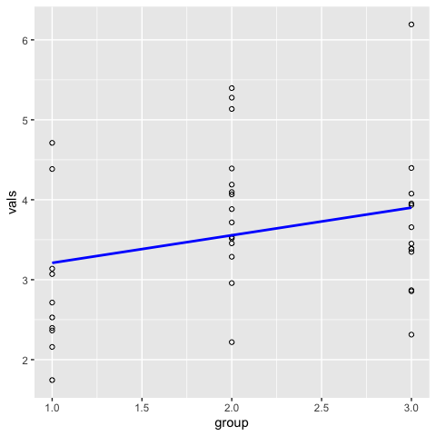
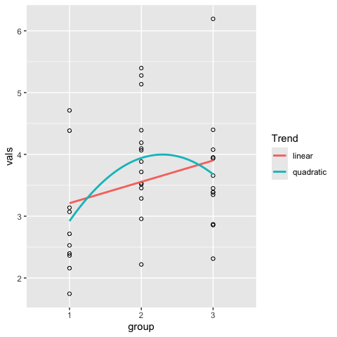
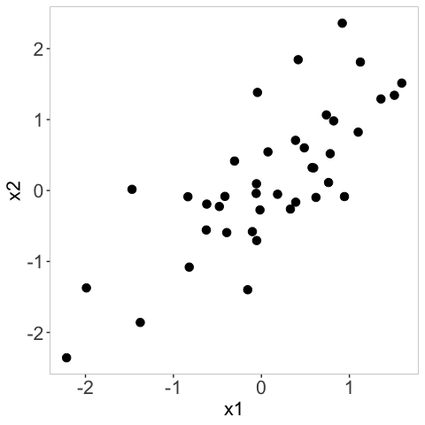

Open science FS26
================
Marcel Miché
2026-02-25

- [Misstrauen](#misstrauen)
  - [Was ist das hier?](#was-ist-das-hier)
    - [Transparenz](#transparenz)
    - [Orientierung, Kompass](#orientierung-kompass)
    - [Checklisten, Regelsammlungen](#checklisten-regelsammlungen)
    - [emmeans](#emmeans)
    - [marginaleffects](#marginaleffects)
  - [Estimated marginal means](#estimated-marginal-means)
- [Kategorial oder nicht?](#kategorial-oder-nicht)
- [Visualisierung](#visualisierung)
  - [Kontinuierlicher Prädiktor](#kontinuierlicher-prädiktor)
  - [Ordinaler Prädiktor](#ordinaler-prädiktor)
- [Literaturverzeichnis](#literaturverzeichnis)

# Misstrauen

Gebe niemals die Kontrolle ab, an von anderen Menschen oder von dir
selbst aufgestellte Regeln. Das heisst, dass Misstrauen wesentlich
besser ist als Vertrauen, im Rahmen von Regelsammlungen, z.B.
Checklisten, weil **Misstrauen** Wachsamkeit fördert (und fordert),
während Vertrauen erschreckend häufig Unachtsamkeit fördert (nicht
zwingend fordert).

Nachdem dies nun geschrieben ist, sei betont, dass Checklisten und
Regelsammlungen dann sehr gut sein können, wenn man mit ihrer Hilfe ein
bewusstes sowie gut begründetes Ziel verfolgt, das von einer gesunden
Portion Misstrauen begleitet wird.

## Was ist das hier?

Eine während des FS26 produzierte Sammlung von hoffentlich relevanten
Hinweisen als auch konkreten Anleitungen, zu Umsetzungsmöglichkeiten von
[open
science](https://poldrack.github.io/psych-open-science-guide/README.html).

### Transparenz

Transparenz ist **das** Synonym schlechthin für open science. Beginnen
wir also mit dem Dokumenttyp dieses
[markdown](https://www.markdownguide.org/) Dokuments. Es wurde mittels
[rmarkdown](https://rmarkdown.rstudio.com/index.html) produziert
([weitere rmarkdown Quelle](https://yihui.org/rmarkdown/)). Wie bei
jedem Dokumenttyp, stellt sich auch hier die Frage nach dem Ziel, d.h.
was soll in welcher Form und auf welchem Weg an wen gelangen, und
weshalb?

**Was?** Informationen unterschiedlicher Art, z.B. Weblinks, Text,
Codebeispiele, Graphiken.

**In welcher Form?** Nach keinen rigiden Vorgaben sowie unmittelbar,
d.h. Weblinks zum Anklicken, Text zum Lesen, Codebeispiele entweder mit
Ergebnis-Output oder ohne, jedenfalls zum Kopieren und ins eigene
R-Skript Einfügen, Graphiken zum Betrachten.

**Auf welchem Weg?** Online (GitHub) und uneingeschränkt frei
zugänglich.

**An wen?** In erster Linie an Studierende dieses open science Seminars,
zudem aber auch an jede Person, der der Weblink weitergeleitet wird.

**Weshalb?** Sammlung relevanter open science Hinweise als auch konkrete
technische Anleitungen, z.B. zur öffentlichen Bereitstellung des
Analysecodes.

### Orientierung, Kompass

Wer verstehen will, braucht Orientierung. Beides geht optimal mit
Einfachheit, entweder als erstem Schritt oder sobald man anfängt, den
Wald vor lauter Bäumen nicht mehr zu sehen.

<div class="figure">


<p class="caption">

Maximal einfache Darstellung einer Schwierigkeit und deren (teilweiser)
Lösung bzw. Behebung.
</p>

</div>

Obige Graphik kann ähnlich wie ein Kompass verwendet werden. Jede/r
Wissenschaftler/in beschäftigt sich in einem gegebenen Augenblick
ausschliesslich mit <ins>einer</ins> **S**chwierigkeit, d.h. etwas das
er/sie (noch) nicht versteht. Beim **W**arum versucht man, mögliche
Erklärungsfaktoren für die **S**chwierigkeit zu finden. Beim **D**arum
prüft man empirisch, ob ein identifizierter Erklärungsfaktor die **S**
tatsächlich (teilweise) produziert (wenn es ein RF ist) oder verhindert
(wenn es ein PF ist). Zuletzt versucht man den Erklärungsfaktor so gut
es geht zu eliminieren (wenn es ein RF ist) oder zu stärken (wenn es ein
PF ist), wodurch im besten, nämlich in einem monokausalen, Fall die
**S** künftig ausbleibt (KS), wenigstens aber geringer als zuvor
ausgeprägt ist (GS).

### Checklisten, Regelsammlungen

Im Seminar zu open science (Bereich: empirische Psychologie) geht es -
aufgrund der quasi-Gleichsetzung von empirisch und datengestützt - um
das Planen, Durchführen und Analysieren von messbaren Konstrukten bzw.
deren vermuteter Zusammenhänge.

In der empirischen Psychologie ist mit Zusammenhang fast immer ein
linearer Zusammenhang gemeint. Ein **linearer Zusammenhang** ist immer
nur dann vorhanden, wenn ein **bedingter Unterschied** in den Daten
vorhanden ist. Dies ist am einfachsten an einem sogenannten Scatterplot
demonstriert, wobei hier ein positiver Zusammenhang gezeigt wird.

``` r
library(correlatio)
library(ggplot2)
set.seed(1) # set.seed to ensure reproducibility
# Simulate two continuous variables x1 and x2
dat <- correlatio::simcor(obs=40, rhos=.7)[[1]]
# Scatterplot and slope of the linear model (lm)
ggplot(data=dat, aes(x=x1, y=x2)) +
    geom_point() +
    geom_smooth(method="lm", se=FALSE)
```

<figure>

<figcaption aria-hidden="true">Scatterplot und slope aus der einfachen
linearen Regression.</figcaption>
</figure>

Man sieht, wenn man x1 von links nach rechts abläuft, dass man dann
tendenziell auf höhere x2 Werte stösst (Englisch: slope = rise over
run). Anders gesagt, es macht einen Unterschied auf Ebene x2, ob man auf
Ebene x1 zwischen -2 und 0 liegt oder ob man x1-Werte grösser als 0 hat.
Ein linearer Zusammenhang ist somit die Verallgemeinerung des Konzepts
Unterschied, den man gewöhnlich nur mit einer Gruppenzugehörigkeit
verbindet, z.B. die Experimentalgruppe habe durchschnittlich höhere
Werte als die Kontrollgruppe. Ein **Unterschied** wird in der Statistik
häufig als **Effekt** bezeichnet (Vorsicht vor Kausalitätsillusionen!).
Der vermutete **Effekt** bezieht sich dabei immer auf die sogenannten
**Erwartungswerte**, die auf theoretischer Populationsebene existieren
(laut Theorie). Die konkrete Schätzung geschieht jedoch anhand von
**Mittelwerten** einer konkreten Stichprobe, die aus der Zielpopulation
stammen soll.

### emmeans

Vor diesem Hintergrund, d.h. der bewussten und gut begründeten Analyse
des Zusammenhangs gemessener psychologischer Konstrukte, empfehle ich
das R Paket [emmeans](https://rvlenth.github.io/emmeans/). Insbesondere
empfehle ich, dass der Text unterhalb der Überschrift [‘Tidyness can be
dangerous’](https://rvlenth.github.io/emmeans/#tidiness-can-be-dangerous)
so oft gelesen wird, bis er in Mark und Bein übergegangen ist.

### marginaleffects

Eine von emmeans unabhängige, jedoch ähnliche Absicht steckt hinter der
Onlinequelle [marginaleffects](https://marginaleffects.com/).
<!-- Auch hier stösst man auf der Titelseite auf ähnliche Hinweise wie bei emmeans, nämlich dass allem Anschein nach viele Forscher/innen (nicht nur Psycholog/innen) in der Vergangenheit und Gegenwart ihr Verständnis komplexer statistischer Modelle sehr häufig überschätzt haben. Mit anderen Worten, sie haben sich auffällig häufig gegen das [Misstrauen](#Misstrauen), d.h. für das Vertrauen entschieden, z.B. in beliebte, doch leider lückenhafte Fachbücher und in 'anwenderfreundliche' Software, die bei genauem Hinsehen eher als anwenderfeindlich gelten sollte. Grund: Diese Software verletzt den Grundsatz 'Hilfe zur Selbsthilfe', d.h. diese Software suggeriert, dass sie, d.h. die Softwarefirmen, den Forscher/innen mühsame (Denk-)Arbeit abnehmen kann, worauf leider die grosse Mehrzahl aller Forscher/innen seither eingestiegen ist. Der Grad an vertrauensvoller Naivität ist hierbei maximal. Die Quittung ist, dass Softwarefirmen zwar viele zufriedene 'Kund/innen' haben, die jedoch leider Forschung betreiben, die viel zu wünschen übrig lässt [@park2023papers]. Beispiele gibt es zu viele um sie hier alle aufzuzählen, deshalb seien stellvertretend nur drei Beispiele genannt:

1. Der hybride p-Wert. Eine Mischung aus dem p-Wert von Fisher und von Neyman-Pearson, die über kein wissenschaftliches Fundament verfügt [@goodman1993p]!
2. Die völlig einseitige sowie fehlerhafte Anwendung der frequentistischen Inferenzstatistik, die Denkfaulheit fördert, weil sie suggeriert, dass der Forschungsprozess fast vollständig mechanisch (objektiv) abläuft [@nuzzo2014scientific], dass dies sogar gut so sei, weil 'subjektive' Einschätzungen den wissenschaftlichen Erfolg gefährden, was blödsinnig erscheint, es sei denn, man hat sich vollkommen dem Positivismus verschrieben [@park2020positivism] .
3. Korrektur für multiples Testen [@greenland2019multiple; @hooper2025adjust]. Die Menge sowie die Titel der Publikationen zu diesem Thema zeigen an, dass eine grosse Mehrheit an Forscher/innen allem Anschein nach sich nicht mit 'subjektiven' Überlegungen hierzu aufhält. Dies zeigt eine beträchtliche Unsicherheit an. -->

## Estimated marginal means

Die ‘population marginal means’ wurden von Searle, Speed, and Milliken
(1980) als Alternative zu den oberflächlichen least squares means
vorgeschlagen. Das heisst lediglich, dass ein etwas genaueres, zugleich
also ein etwas längeres bzw. intensiveres Hinsehen auf die Ergebnisse
einer empirischen Datenanalyse vorgeschlagen wurde. Um einigermassen
nachvollziehen zu können, warum diese doch scheinbar so
selbstverständliche Angelegenheit (genau(er) hinzusehen) als
‘Alternativvorschlag’ bezeichnet wird, der ausgerechnet an
Forscher/innen gerichtet war bzw. ist, braucht es Hintergrundwissen zu
Forschungsparadigmen (Pandey et al. 2025). Die Tatsache, dass sehr
viele, leider vor allem Nachwuchsforscher/innen, so gut wie nichts zu
Forschungsparadigmen wissen, zeigt überdeutlich den Trend in der
‘modernen’ Forschung an. Es muss in erster Linie der äusserliche Schein
gewahrt werden, obwohl nichts anderes so unwissenschaftlich ist. Der
eigentliche Kern der Wissenschaft besteht doch gerade darin, den
äusserlichen Schein durch genaue(re)s Hinsehen zu durchbrechen.

Schauen wir uns einmal ein Beispiel zu ‘population marginal means’ an
(geläufiger bekannt als ‘marginal effects’).

``` r
# Simulation von 10, 15 und 13 Werten auf 3 Gruppen verteilt.
set.seed(5)
vals1 <- rnorm(n=10, mean=3)
set.seed(4)
vals2 <- rnorm(n=15, mean=3.5)
set.seed(49)
vals3 <- rnorm(n=13, mean=4)
df <- data.frame(
    group=factor(rep(1:3, times=c(10, 15, 13))),
    vals=c(vals1, vals2, vals3)
)
# Mittelwerte der drei Gruppen
c(mean(vals1), mean(vals2), mean(vals3))
```

    ## [1] 2.921148 3.941326 3.678518

``` r
mod <- lm(vals ~ group, data=df)
coefficients(summary(mod))
```

    ##              Estimate Std. Error   t value     Pr(>|t|)
    ## (Intercept) 2.9211485  0.2901259 10.068556 7.088035e-12
    ## group2      1.0201775  0.3745509  2.723735 1.000175e-02
    ## group3      0.7573696  0.3859035  1.962588 5.768205e-02

``` r
# Plot
ggplot(df) +
    aes(x = group, y = vals) +
    geom_point(shape = 1)
```

<!-- -->

Da der Prädiktor hier kategorial ist, erhalten wir in der
Standardausgabe die Unterschiede zwischen group2 und group1 (1.020) und
zwischen group3 und group1 (.757). Wenn nichts spezifiziert wird, nimmt
R die unterste Kategorie (hier group1) als Referenz.

Mit dem ‘emmeans’ Paket lassen sich sehr viele genauere Einblicke in das
Analyseresultat gewinnen. Zu den einfachsten Einblicken gehören die
paarweisen
[Kontraste](https://cloud.r-project.org/web/packages/emmeans/vignettes/comparisons.html)
zwischen den drei Gruppen. Einzig der Kontrast zwischen group1 und
group2 steht bereits in der summary Ausgabe des linearen Models (lm),
sofern die Variable group als factor in R definiert ist.

``` r
library(emmeans)
# ctrs: contrasts
ctrs <- emmeans::emmeans(mod, specs = "group")
pairs(ctrs)
```

    ##  contrast        estimate    SE df t.ratio p.value
    ##  group1 - group2   -1.020 0.375 35  -2.724  0.0264
    ##  group1 - group3   -0.757 0.386 35  -1.963  0.1366
    ##  group2 - group3    0.263 0.348 35   0.756  0.7321
    ## 
    ## P value adjustment: tukey method for comparing a family of 3 estimates

Der Vergleich der beiden Ergebnisausgaben zeigt die zwei bereits
bekannten **Unterschiede** zwischen group1 und group2 sowie zwischen
group1 und group3, aber eben zusätzlich den **Unterschied** zwischen
group2 und group3. Zudem wird automatisch eine Korrektur für multiples
Testen gemäss Tukey durchgeführt. Wenn man keine Korrektur möchte
(Hooper 2025), dann muss man in der emmeans Funktion das Argument adjust
auf ‘none’ setzen. Es lassen sich etliche Dinge spezifizieren als auch
visualisieren.

``` r
plot(ctrs, comparisons = TRUE)
```

<figure>

<figcaption aria-hidden="true">Paarweise Kontraste.</figcaption>
</figure>

Ob ein Kontrast statistisch signifikant ist, zeigt sich durch
Nichtüberlappung der roten Pfeile, hier zwischen group1 und group2.
Überlappung (hier group2 und group3 sowie group1 und group3) also
bedeutet, dass diese Kontraste statistisch nicht signifikant sind (es
wird hierbei einbezogen, ob bzw. welche Korrektur für multiples Testen
durchgeführt worden ist).

**Vorläufiges Fazit**: Warum würde sich ein/e Forscher/in, der/die
grosses Interesse an den Analyseergebnissen hat, sich mit einer
oberflächlichen summary Ausgabe zufrieden geben? Vier mögliche Gründe:

1.  Die Person weiss nicht gut genug Bescheid, mit der Statistiksoftware
    umzugehen und *muss* sich daher mit der Standardausgabe zufrieden
    geben.
2.  Die Person hat kein Interesse an detaillierten Analyseergebnissen.
3.  Die Person möchte das Risiko um keinen Preis eingehen, ein stat.
    nicht signifikantes Ergebnis zu sehen.
4.  Die Person orientiert sich daran, was die grosse Mehrheit anderer
    Forscher/innen im eigenen Forschungsfeld macht. Wenn ‘marginal
    effects’ dort nur sehr selten berichtet werden, dann berichtet diese
    Person sie eben auch nicht.

**Zusatz**: Bei meinen Recherchen war ich jedenfalls sehr überrascht,
wie selten man beim Thema ‘marginal effects’ auf psychologische
Publikationen stösst (Thomson, Maskrey, and Vlaev 2017; Hautamäki et al.
2025, 2026). Einen sehr kurzen, aber aufschlussreichen Erklärungsansatz
liefert Norton, Dowd, and Maciejewski (2019). Darüber hinaus dürfen
Mize, Doan, and Long (2019) und Howell-Moroney (2024) eine wertvolle
Informationsquelle sein.

# Kategorial oder nicht?

Die weiterhin am stärksten verbreitete Art in der empirischen
Psychologie, Analyseergebnisse zu betrachten, ist kategorial. Das
heisst, ein statistisches Signifikanzniveau, meist unreflektiert die
konventionelle 5% Grenze, wird als Entscheidungskriterium akzeptiert
(Emmert-Streib 2024). Der Blick des/der Forscher/in richtet sich also
unwillkürlich auf den empirischen p-Wert. Der Vorteil, bei genauerem
Hinsehen eher ein Nachteil, liegt im Entscheidungsautomatismus, d.h. ein
**genaueres** bzw. **intensiveres** Hinsehen auf die Ergebnisse scheint
unnötig zu sein. *Oder nicht?* Noch dazu suggeriert es so etwas wie
Sicherheit und Entschlossenheit, was man leicht mit ‘Expertise’
verwechseln kann. Kurz: Ein angenehmes Gefühl, seinen Forschungserfolg
so automatisch und schnell bestätigt zu bekommen. Es könnte jedoch auch
als etwas zu schön um wahr zu sein erscheinen (bei genauerem Hinsehen).
*Oder?* (Haeffel 2022)

Hingegen, wenn man statt einer kategorialen Signifikanzgrenze das
komplette Konfidenzintervall dimensional versteht, dann wäre man
gezwungen, etwas genauer, und zudem auf eine andere Weise, hinzusehen.
Bei genauerem Hinsehen fällt jedoch auf, dass man sogar dann immer noch
(teilweise) kategorial handelt, jedenfalls dann, wenn man ein bestimmtes
Konfidenzintervall (KI), z.B. das 95%-KI, verwendet. Versteift man sich
also auf keine bestimmte Prozentzahl, dann käme man schliesslich zur
sogenannten p-Wert Funktion (Infanger and Schmidt-Trucksäss 2019; Rafi
and Greenland 2020). Hier läge der Vorteil darin, dass ohne
**genaueres** bzw. **intensiveres** Hinsehen überhaupt nichts zustande
kommen kann. Dies habe ich ausführlich im HTML ‘pValueIssue’
beschrieben.

**Vorläufiges Fazit**: Je mehr man die kategoriale Betrachtung der
Analyseergebnisse ablehnt, desto aufwändiger wird die Arbeit rund um die
Analyseergebnisse. Genau dasselbe gilt auch für das Berichten von
‘marginal effects’. Man schafft sich, und somit auch dem/der Leser/in
der Publikation, eine beträchtlich grössere Herausforderung, verglichen
mit der blitzschnellen Kenntnisnahme, ob das summary Standardergebnis
statistisch signifikant ist. Je nach Perspektive ist das eine oder das
andere von Vor- bzw. Nachteil.

# Visualisierung

Auch ohne publizierte Forschungsempfehlungen, wie etwa Pek and Flora
(2018), ist es wohl allen klar, dass empirische Ergebnisse wesentlich
besser verstanden werden können, wenn sie gut visualisiert worden sind.
‘Gut’ bedeutet hier ‘dem Verständnis förderlich’.

Nehmen wir einmal die simulierten Daten von oben (3 ungleich grosse
Gruppen, kontinuierlicher Outcome) und visualisieren unterschiedliche
Zusammenhänge, je nachdem wie der Prädiktor ‘Gruppe’ definiert wird.

## Kontinuierlicher Prädiktor

``` r
dfKontin <- df
dfKontin$group <- as.numeric(dfKontin$group)
modKontin <- lm(vals ~ group, data=dfKontin)
coefficients(summary(modKontin))
```

    ##              Estimate Std. Error  t value     Pr(>|t|)
    ## (Intercept) 2.8650640  0.4463164 6.419357 1.919239e-07
    ## group       0.3453123  0.2011934 1.716320 9.469815e-02

``` r
# Plot
ggplot(dfKontin) +
    aes(x = group, y = vals) +
    geom_point(shape = 1) +
    geom_smooth(color = "blue", 
                method = lm, se = FALSE)
```

<figure>

<figcaption aria-hidden="true">Kontinuierlicher Prädiktor.</figcaption>
</figure>

``` r
# Prüfe, ob der Intercept für group = 0 korrekt ist:
predict(modKontin, newdata = data.frame(group=0))
```

    ##        1 
    ## 2.865064

``` r
# Gebe Vorhersage auch für Werte 1-3 aus:
predict(modKontin, newdata = data.frame(group=1:3))
```

    ##        1        2        3 
    ## 3.210376 3.555689 3.901001

Da der Prädiktor hier als kontinuierliche Variable behandelt wird,
berechnet das lineare Model (lm) den Intercept für die
Prädiktorausprägung 0, obwohl es diese Ausprägung gar nicht gibt. Wir
erhalten als summary Ergebnis eine durchschnittliche Steigung von .3453.
Sofern ein/e Forscher/in einen guten Grund für solch eine Information
hätte, stünde dieser Berechnung nichts im Wege. Jedoch, etwas zu
berechnen und im Anschluss einen Sinn darin zu suchen, ist nicht
empfehlenswert.

## Ordinaler Prädiktor

Hier ist der kategoriale Prädiktor aufsteigend geordnet. Dies veranlasst
R einen linearen und separat einen quadratischen Zusammenhang zu testen.

``` r
dfOrd <- df
dfOrd$group <- ordered(dfKontin$group)
modOrd <- lm(vals ~ group, data=dfOrd)
coefficients(summary(modOrd))
```

    ##               Estimate Std. Error   t value     Pr(>|t|)
    ## (Intercept)  3.5136641  0.1509366 23.279066 6.940244e-23
    ## group.L      0.5355412  0.2728750  1.962588 5.768205e-02
    ## group.Q     -0.5237766  0.2494604 -2.099638 4.303940e-02

``` r
# Plot
ggplot(dfOrd) +
    aes(x = group, y = vals) +
    geom_point(shape = 1) +
    geom_smooth(aes(x = unclass(group), color = "1"), 
                formula = y ~ x, 
                method = lm, se = FALSE) +
    geom_smooth(aes(x = unclass(group), color = "2"), 
                formula = y ~ poly(x, 2), 
                method = lm, se = FALSE) +
    scale_color_discrete("Trend", labels = c("linear", "quadratic"))
```

<figure>

<figcaption aria-hidden="true">Ordinaler Prädiktor.</figcaption>
</figure>

``` r
# Prüfe, ob der Intercept korrekt ist.
mean(predict(modOrd, newdata=data.frame(group=ordered(1:3))))
```

    ## [1] 3.513664

Der lineare Trend ist exakt derselbe wie oben ([siehe Kontinuierlicher
Prädiktor](#kontinuierlicher-prädiktor)). Der quadratische Trend geht
exakt durch die Mittelwerte der drei Gruppen (2.92, 3.94, 3.68). Der
Intercept ist der Mittelwert dieser drei Mittelwerte (3.51). Der
quadratische Trend zeigt einen besseren Modelfit, weil der Betrag des
t-Wertes grösser ist als beim linearen Trend. Dies ist nicht
überraschend, weil der quadratische Trend alle drei Mittelwerte exakt
‘trifft’, was als ‘Overfitting’ bezeichnet wird.

**Vorläufiges Fazit**: Genau wie die gesamte Publikation, so sollte auch
eine Graphik so leicht verständlich wie möglich sein, was bei so etwas
Selbstverständlichem wie der Erkennbarkeit beginnt, z.B. der
Schriftgrösse der Achsen:

``` r
ggplot(data=dat, aes(x=x1, y=x2)) +
    geom_point(size=3)  +
    theme(
        panel.background = element_blank(),
        axis.text.x=element_text(size=16),
        axis.title.x=element_text(size=16),
        axis.text.y=element_text(size=16),
        axis.title.y = element_text(size=16),
        panel.border = element_rect(color="grey", fill=NA))
```

<figure>

<figcaption aria-hidden="true">Grössere Beschriftung und bessere
Erkennbarkeit.</figcaption>
</figure>

# Literaturverzeichnis

<div id="refs" class="references csl-bib-body hanging-indent"
entry-spacing="0">

<div id="ref-emmert2024trends" class="csl-entry">

Emmert-Streib, Frank. 2024. “Trends in Null Hypothesis Significance
Testing: Still Going Strong.” *Heliyon* 10 (21).

</div>

<div id="ref-haeffel2022psychology" class="csl-entry">

Haeffel, Gerald J. 2022. “Psychology Needs to Get Tired of Winning.”
*Royal Society Open Science* 9 (6).

</div>

<div id="ref-hautamaki2026risk" class="csl-entry">

Hautamäki, Sari, Taina Laajasalo, Noora Ellonen, Laura Mielityinen, and
Hanna-Mari Lahtinen. 2026. “Risk and Protective Factors for Child Sexual
Abuse: A Comparison of 2013 and 2022.” *Journal of Child Sexual Abuse*,
1–20.

</div>

<div id="ref-hautamaki2025psychosocial" class="csl-entry">

Hautamäki, Sari, Iina Savolainen, Emmi Kauppila, Anu Sirola, and Atte
Oksanen. 2025. “Psychosocial Factors Behind Addiction—a Six-Wave
Longitudinal Comparison of at-Risk Gambling and Drinking.” *Alcohol and
Alcoholism* 60 (1): agae089.

</div>

<div id="ref-hooper2025adjust" class="csl-entry">

Hooper, Richard. 2025. “To Adjust, or Not to Adjust, for Multiple
Comparisons.” *Journal of Clinical Epidemiology* 180: 111688.

</div>

<div id="ref-howell2024inconvenient" class="csl-entry">

Howell-Moroney, Michael. 2024. “Inconvenient Truths about Logistic
Regression and the Remedy of Marginal Effects.” *Public Administration
Review* 84 (6): 1218–36.

</div>

<div id="ref-infanger2019p" class="csl-entry">

Infanger, Denis, and Arno Schmidt-Trucksäss. 2019. “P Value Functions:
An Underused Method to Present Research Results and to Promote
Quantitative Reasoning.” *Statistics in Medicine* 38 (21): 4189–97.

</div>

<div id="ref-mize2019general" class="csl-entry">

Mize, Trenton D, Long Doan, and J Scott Long. 2019. “A General Framework
for Comparing Predictions and Marginal Effects Across Models.”
*Sociological Methodology* 49 (1): 152–89.

</div>

<div id="ref-norton2019marginal" class="csl-entry">

Norton, Edward C, Bryan E Dowd, and Matthew L Maciejewski. 2019.
“Marginal Effects—Quantifying the Effect of Changes in Risk Factors in
Logistic Regression Models.” *Jama* 321 (13): 1304–5.

</div>

<div id="ref-pandey2025research" class="csl-entry">

Pandey, Chandra Shekhar, Patanjali Mishra, Shri Ram Pandey, Ratan Deep
Singh, and Shweta Pandey. 2025. “Research Paradigms: A Systematic
Literature Review of Methodological Shifts and Interdisciplinary
Approaches in Research.” *Quality & Quantity*, 1–29.

</div>

<div id="ref-pek2018reporting" class="csl-entry">

Pek, Jolynn, and David B Flora. 2018. “Reporting Effect Sizes in
Original Psychological Research: A Discussion and Tutorial.”
*Psychological Methods* 23 (2): 208.

</div>

<div id="ref-rafi2020semantic" class="csl-entry">

Rafi, Zad, and Sander Greenland. 2020. “Semantic and Cognitive Tools to
Aid Statistical Science: Replace Confidence and Significance by
Compatibility and Surprise.” *BMC Medical Research Methodology* 20 (1):
244.

</div>

<div id="ref-searle1980population" class="csl-entry">

Searle, Shayle R, F Michael Speed, and George A Milliken. 1980.
“Population Marginal Means in the Linear Model: An Alternative to Least
Squares Means.” *The American Statistician* 34 (4): 216–21.

</div>

<div id="ref-thomson2017making" class="csl-entry">

Thomson, Carrie Louise, Neal Maskrey, and Ivo Vlaev. 2017. “Making
Decisions Better: An Evaluation of an Educational Intervention.”
*Journal of Evaluation in Clinical Practice* 23 (2): 251–56.

</div>

</div>
